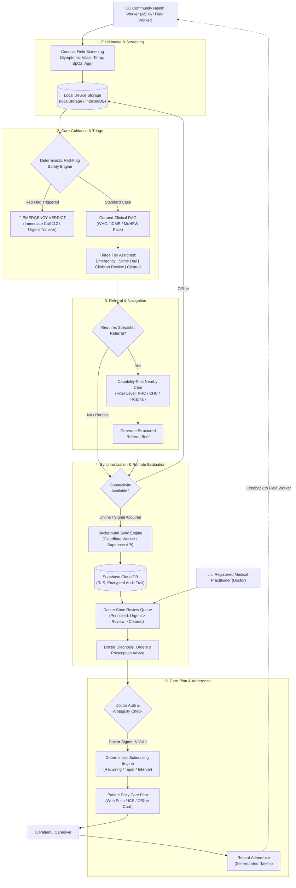
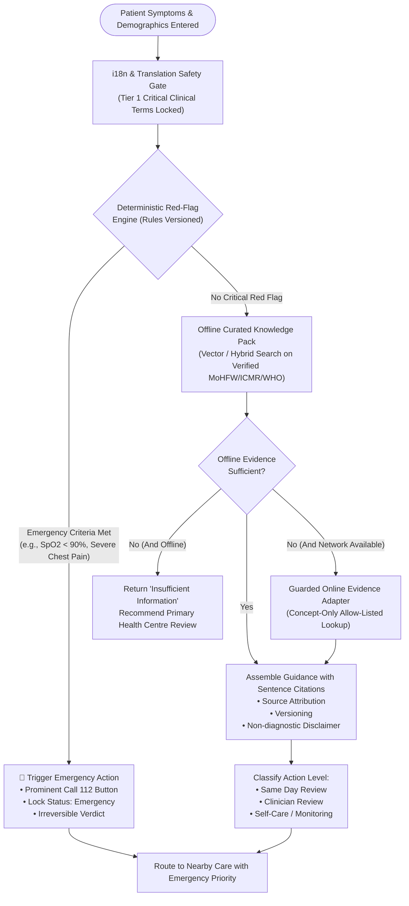
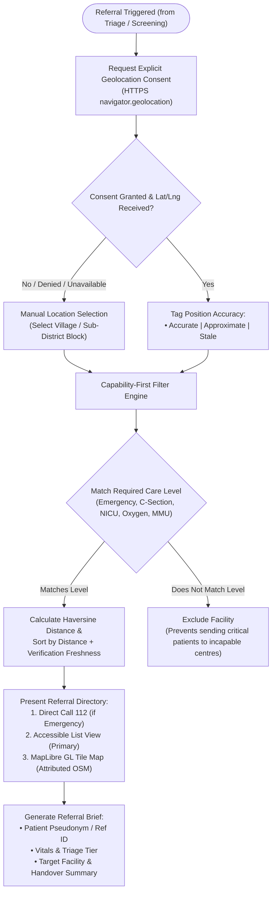
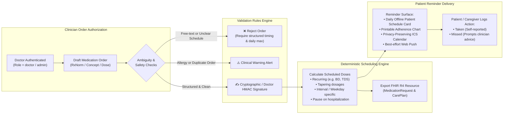
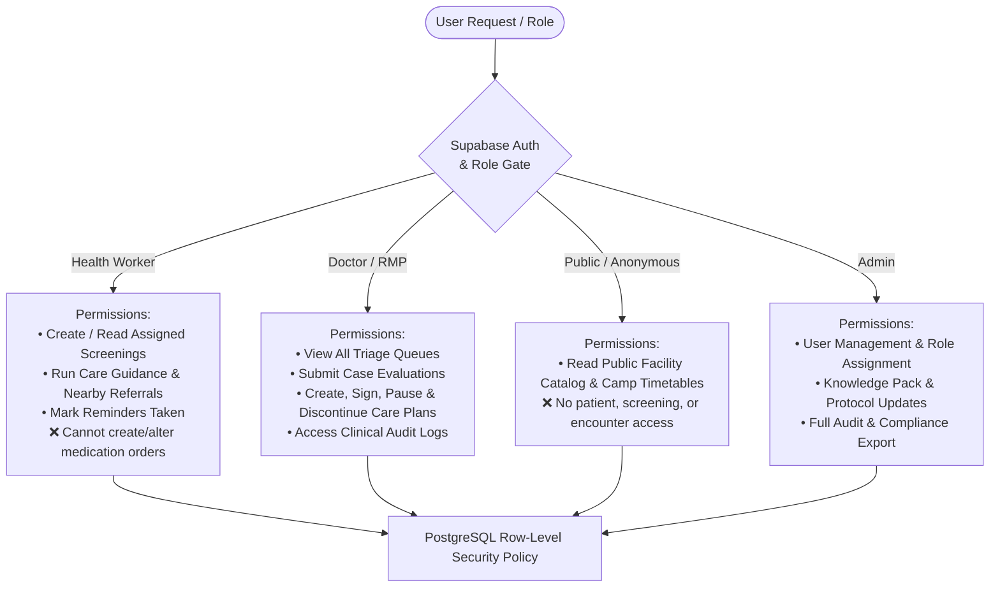

# Arogya Relay — Workflow Architecture & Diagrams

This document outlines the operational and data workflows of **Arogya Relay**, an offline-first disease surveillance and clinical decision-support interface engineered for community health workers (ASHAs/ANMs) operating in remote, low-bandwidth environments.

---

## 1. High-Level End-to-End Operational Workflow

The overall lifecycle from patient field intake to doctor review, facility referral, and medication adherence monitoring.



---

## 2. Clinical Care Guidance & Decision-Support Workflow

Arogya Relay implements a **safety-first, deterministic-before-AI** clinical triage pipeline. Emergency verdicts are irrevocable and cannot be downgraded by generative models.



---

## 3. Offline-First Synchronization & Storage Lifecycle

Designed to withstand field realities: dead zones, intermittent 2G networks, and sudden device resets.

```mermaid
sequenceDiagram
    autonumber
    actor ASHA as 👩‍⚕️ Health Worker
    participant UI as 📱 Client Interface
    participant LocalDB as 💾 Local Store (localStorage/IDB)
    participant SyncMgr as 🔄 Sync Manager
    participant API as 🌐 Supabase API / Worker
    participant RemoteDB as 🗄️ PostgreSQL Database

    ASHA->>UI: Submit Screening Form
    UI->>LocalDB: Write ScreeningRecord (synced = false, id = SCR-XXX)
    UI-->>ASHA: Instant UI Confirmation (Optimistic UX)

    SyncMgr->>SyncMgr: Network Health & Ping Check
    alt When Offline / No Network
        SyncMgr-->>UI: Badge: "Reports stored securely offline"
        Note over LocalDB,SyncMgr: Records queued safely; queue count updated
    else When Connectivity Restored
        SyncMgr->>LocalDB: Read all unsynced records
        LocalDB-->>SyncMgr: Return pending batches
        SyncMgr->>API: POST /api/screenings/sync (Bounded Payload)
        API->>RemoteDB: Upsert Records with RLS & Role Verification
        RemoteDB-->>API: 200 OK (Batch Acknowledged)
        API-->>SyncMgr: Sync Receipt & Server Timestamps
        SyncMgr->>LocalDB: Mark synced = true or purge synced cache
        SyncMgr-->>UI: Status Update: "All records synchronized"
    end
```

---

## 4. Capability-First Nearby Care & Referral Workflow

Facilities are ranked strictly by **capability matching first**, before distance. A closer facility lacking maternity or oxygen support is never recommended over a slightly further, fully equipped hospital.



---

## 5. Doctor Care Plan, Medication Orders & Reminders

Ensures patient safety through strict doctor-only authoring, schedule ambiguity prevention, and deterministic reminder generation.



---

## 6. Security, Privacy & Role-Based Access Boundary


